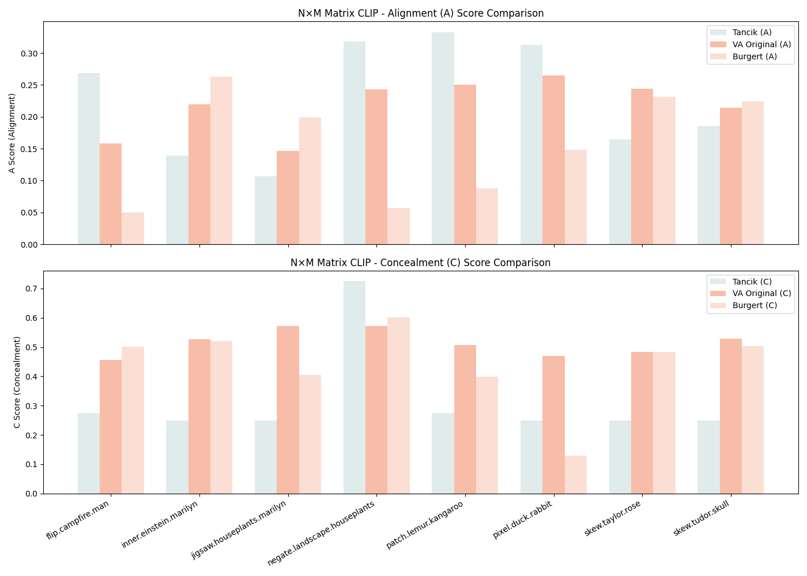
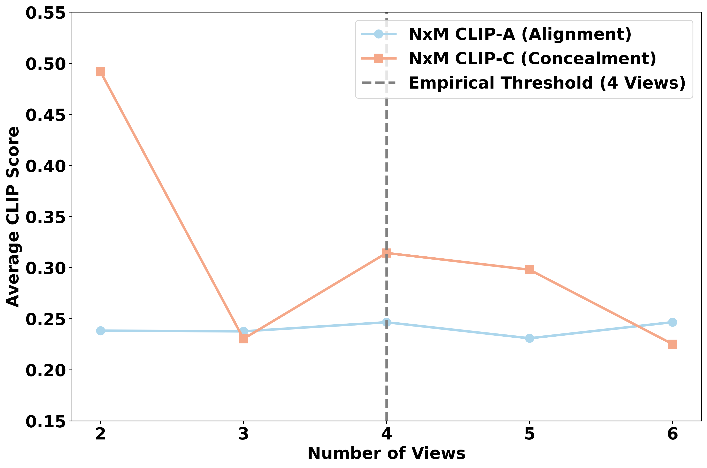
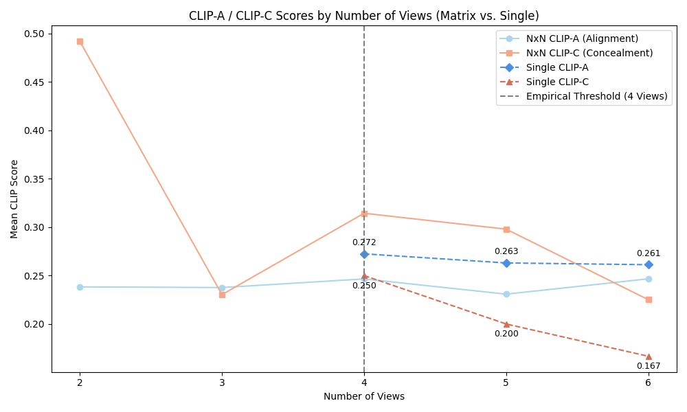

# Experiment Results
To better and directly save our results in a series of experiments, we select to record them in here.
If you want to see visual details of our experiments, please check in the following folders:
```bash
├── baselines/                    # Baseline experiments for view 2
│   ├── Burgert/
│   │   └── outputs/
│   ├── tancik/
│   │   └── outputs/
├── outputs/                      # Original experiments for view 2 & view 3
├── extends/                      # Extended experiments for part 1 & 2
```

## Reproducible Experiments
Only focus on view 2, we testing three different baselines, and collect their results.

Because of the difference between Tancik and others, Tancik only provide the method of view 2 generation.
Although Burgert implement the method of view 2, it also cover some contents of image encryption or steganography, these part apply more than two prompts for view. If we apply these parts, which are irrelevant to illusion generation, the experiments may be unreasonable.

Therefore, we decide to use the stable implementation of testing methods to generate view 2.

### N×M CLIP Scores for View 2
**Total Table:**
<table border="1" cellspacing="0" cellpadding="6">
  <tr>
    <th rowspan="2">Example Name</th>
    <th colspan="3">A Score (Alignment)</th>
    <th colspan="3">C Score (Concealment)</th>
  </tr>
  <tr>
    <th>Burgert</th><th>Tancik</th><th>VA Original</th>
    <th>Burgert</th><th>Tancik</th><th>VA Original</th>
  </tr>

  <tr>
    <td>flip.campfire.man</td>
    <td>0.0502</td><td><b>0.2682</b></td><td>0.1582</td>
    <td><b>0.5008</b></td><td>0.2742</td><td>0.4553</td>
  </tr>
  <tr>
    <td>inner.einstein.marilyn</td>
    <td><b>0.2635</b></td><td>0.1394</td><td>0.2196</td>
    <td>0.5210</td><td>0.2500</td><td><b>0.5273</b></td>
  </tr>
  <tr>
    <td>jigsaw.houseplants.marilyn</td>
    <td><b>0.1988</b></td><td>0.1070</td><td>0.1468</td>
    <td>0.4046</td><td>0.2500</td><td><b>0.5715</b></td>
  </tr>
  <tr>
    <td>negate.landscape.houseplants</td>
    <td>0.0573</td><td><b>0.3184</b></td><td>0.2432</td>
    <td>0.6020</td><td><b>0.7248</b></td><td>0.5722</td>
  </tr>
  <tr>
    <td>patch.lemur.kangaroo</td>
    <td>0.0881</td><td><b>0.3329</b></td><td>0.2503</td>
    <td>0.3992</td><td>0.2756</td><td><b>0.5063</b></td>
  </tr>
  <tr>
    <td>pixel.duck.rabbit</td>
    <td>0.1480</td><td><b>0.3127</b></td><td>0.2653</td>
    <td>0.1290</td><td>0.2500</td><td><b>0.4696</b></td>
  </tr>
  <tr>
    <td>skew.taylor.rose</td>
    <td>0.2315</td><td>0.1648</td><td><b>0.2439</b></td>
    <td><b>0.4844</b></td><td>0.2500</td><td>0.4827</td>
  </tr>
  <tr>
    <td>skew.tudor.skull</td>
    <td><b>0.2244</b></td><td>0.1853</td><td>0.2141</td>
    <td>0.5023</td><td>0.2500</td><td><b>0.5298</b></td>
  </tr>
</table>

**Bar Plot:**


From this plot, we can know that the performance of the three methods—Tancik, VA Original, and Burgert—varies significantly across the two evaluation dimensions: A Score (Alignment) and C Score (Concealment).

- Tancik generally achieves the highest A scores, indicating strong image-prompt alignment and faithful reconstruction across most examples. However, it consistently shows low C scores, suggesting limited diversity across views and reduced perceptual concealment, which may limit the illusion effect.

- Burgert, in contrast, often ranks lowest in A score, reflecting poor alignment to the original prompt. Despite this, it performs consistently well on C scores, implying high dissimilarity between views and better illusionary concealment. However, the alignment degradation often undermines the interpretability and consistency of the generated content.

- VA Original offers a more balanced trade-off: while not always topping either A or C individually, it maintains moderately high alignment scores and strong concealment performance across most examples. This balance highlights its advantage in generating images that are both faithful to the prompt and visually deceptive under different views.

In conclusion, the VA Original method demonstrates the best overall performance when both alignment and concealment are jointly considered. It effectively bridges the gap between visual fidelity and multi-view illusion strength, making it a favorable choice for generating consistent yet perceptually diverse image illusions.

## Extend Experiments
### PART 1: Finding the Threshold of View Count
We collect results of given examples in different view counts, each one has 5 trials.
Then we calculate the average A and C scores for each view count to see the threshold of view count.

- **N * M CLIP Scores for View 2, 3, 4, 5, 6**

| View Count | Avg. A Score | Avg. C Score |
|------------|--------------|--------------|
| View 2     | 0.2383       | 0.4917       |
| View 3     | 0.2376       | 0.2303       |
| View 4     | 0.2465       | 0.3143       |
| View 5     | 0.2308       | 0.2979       |
| View 6     | 0.2466       | 0.2251       |

- **Single View CLIP Scores for View 4, 5, 6**

| View Count | Avg. A Score | Avg. C Score |
|------------|--------------|--------------|
| View 4     | 0.2724       | 0.2500       |
| View 5     | 0.2630       | 0.2000       |
| View 6     | 0.2612       | 0.1667       |

### Discussion
#### NxN Matrix CLIP Scores for View 2 - 6


From the plot, we can observe that a view count of 4 serves as a critical threshold. At this point, both the Alignment (A) and Concealment (C) scores reach a relatively balanced level. Beyond 4 views, both scores exhibit a consistent decline — in some cases, approaching zero — indicating that adding more views may degrade both alignment and concealment performance. This trend suggests that using 4 views achieves an optimal trade-off between preserving alignment with the prompt and maintaining perceptual concealment across views.
#### Single-View CLIP Scores for View 4 - 6


Additionally, in this plot, we discuss the single-image CLIP scores from 4 to 6 views. The CLIP-A (alignment) scores remain relatively stable across these three view counts, with only a slight decrease from 0.2724 (4 views) to 0.2612 (6 views). This indicates that the semantic alignment between the prompt and image content is largely preserved even as the number of views increases.

In contrast, the CLIP-C (concealment) scores show a more noticeable decline, dropping from 0.2500 at 4 views to 0.1667 at 6 views. This consistent reduction suggests that the model becomes more effective at hiding semantic content from CLIP’s perspective as views increase—potentially due to increased visual clutter or intentional obfuscation.

#### Conclusion
Taken together with the previous NxM matrix results, this analysis reinforces the empirical threshold of **4 Views** as a balance point. At this level, both alignment and concealment are reasonably optimized, while increasing the view count beyond this threshold leads to diminishing alignment quality without substantial concealment gain.

### PART 2: Adaptive Enhancement for Four-View Illusion Generation

We use the same examples to test different adaptive methods to examine whether they can enhance the performance of generating four-view illusions.
The five strategies are:

* **Solution 1: Prompt Perturbation via Shared Seed**
  Adds controlled Gaussian noise to prompt embeddings under a fixed seed to encourage consistent diversity across views.

* **Solution 2: Averaged Prompt Embedding**
  Averages prompt embeddings across views and broadcasts the same representation, attempting to unify semantic content.

* **Solution 3: CLIP-Guided View Filtering**
  Generates multiple candidates and selects views with high text similarity before resampling, to reinforce alignment.

* **Solution 4: Adaptive Soft Guidance**
  Dynamically adjusts classifier-free guidance (CFG) strength based on inter-view cosine similarity; softly boosts coherence.

* **Solution 5: Adaptive Strong Guidance**
  A more aggressive variant that sharply increases CFG scale based on inter-view similarity, enforcing tighter consistency.


**Total Table:**
| Method              | A Score ↑  | C Score ↑  | Remarks            |
| ------------------- | ---------- | ---------- | ------------------ |
| **Baseline**        | 0.2848     | 0.5801     | Stable             |
| **Solution 1**      | 0.3027     | 0.6210     | Diversity-enhanced |
| **Solution 2**      | 0.1322     | 0.1289     | Severely degraded  |
| **Solution 3**      | 0.2353     | 0.1264     | Loss of diversity  |
| **Adaptive Soft**   | **0.3377** | **0.6250** | Best overall       |
| **Adaptive Strong** | 0.3124     | 0.6174     | Over-constrained   |


Among all evaluated strategies, **adaptive soft guidance** achieves the best balance between image-text alignment and multi-view semantic concealment. Prompt perturbation via shared seeds (solution1) is also beneficial in isolation, but detrimental when combined with adaptive guidance due to conflict in inductive biases. Strategies based on prompt averaging or hard CLIP filtering are shown to be less effective or unstable.