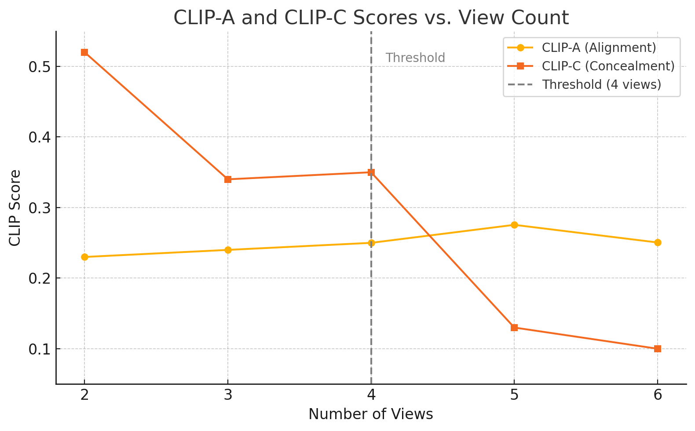

# README

This repository is adapted from [visual_anagrams](https://github.com/dangeng/visual_anagrams/tree/main), fixed and extended by **Chen Xuanxin** to support more general and scalable optical illusion generation using diffusion models.

## 🔧 Environment Setup

We recommend using **Colab Pro** or a server with at least **A100 GPU** and **100–200 CU hours** available. Our generation pipeline may consume **16–20 GB GPU memory** due to multi-view generation and guidance computation.

## 🎯 Project Goals

Our research aims to explore how diffusion models can generate multi-view optical illusions from **arbitrary text prompts**. Specifically, we focus on:

- **View Count Threshold Estimation**: What is the maximum number of views before illusion quality degrades?
- **Adaptive Enhancement for Four-View Illusion Generation**: How can we maintain perceptual coherence when generating more complex illusions?

---

## 🧪 Testing Tasks

We define standard generation tasks categorized by the number of views:

### View 2 Task
- Includes transformations like `identity + flip`, `identity + negate`, etc.
- Measures illusion consistency and perceptual misalignment using **A & C scores**.

### View 3 Task
- Introduces an additional view (e.g., `identity + flip + jigsaw`).
- Allows exploration of motion coherence and visual anagram effects in more dynamic settings.

### View 4–6 Task (Our Focus)
- View 4: Set as our **threshold test case** based on empirical results.
- View 5–6: Used to evaluate **degradation trends** in A & C metrics as view count increases.

---

## 🧩 Views: Transformation Definitions

Each **view** corresponds to a specific transformation applied to an image. These operations disrupt appearance while preserving latent semantics. Below are supported views:

| View Name         | Description                                                                 |
|-------------------|-----------------------------------------------------------------------------|
| `identity`        | No transformation; original image baseline.                                 |
| `rotate_180`      | 180-degree rotation.                                                         |
| `rotate_cw`       | 90-degree clockwise rotation.                                                |
| `rotate_ccw`      | 90-degree counterclockwise rotation.                                        |
| `flip`            | Horizontal flip (mirror reflection).                                        |
| `negate`          | RGB value inversion.                                                        |
| `skew`            | Perspective distortion simulating a slanted surface.                        |
| `patch_permute`   | Patch-wise permutation (block-level scrambling).                            |
| `pixel_permute`   | Pixel-level permutation (strongest perceptual disruption).                  |
| `inner_circle`    | Retains center circle, distorts surrounding area.                           |
| `square_hinge`    | Applies a hinged folding effect.                                             |
| `jigsaw`          | Rearranges grid segments like a jigsaw puzzle.                              |

---

## 📐 Evaluation Metrics

We use two CLIP-based metrics to evaluate illusions:

- **A (Alignment)**: Measures similarity between generated images and their prompts.
- **C (Concealment)**: Measures dissimilarity across views, encouraging perceptual diversity.

Both are measured in two formats:
- **Single image vs. prompts**
- **N × M matrix** across all views and prompts

---

## 🧪 Our Research Questions (RQs)

### Part 1: View Count Threshold Estimation

We test view counts from **2 to 6**, running 5 trials per case and measuring average A and C scores. Our results show that:

- **4 views** yield the best trade-off between alignment and concealment.
- Performance **declines beyond 4 views**, suggesting it as the **empirical threshold**.

### Part 2: Adaptive Enhancement for View-4 Illusions

View-4 illusions are especially challenging. To address this, we test a series of adaptive methods:

- **Shared Seed Perturbations**: Improve diversity without losing consistency.
- **Prompt Embedding Fusion**: Align latent semantic space across views.
- **Adaptive CFG Guidance**: Use intra-view CLIP similarity to adjust text conditioning strength.
- **CLIP-Guided View Selection**: Filter incompatible view combinations.

Our findings show **individual improvements**, but **combined strategies do not always yield additive benefits** due to over-regularization, highlighting the **trade-off space** in multi-view sampling.

---

## 📊 Sample Results

Example A & C scores from different view setups (N×M CLIP evaluation):

| View Count | Avg. A Score | Avg. C Score |
|------------|--------------|--------------|
| View 2     | 0.2383       | 0.4917       |
| View 3     | 0.2376       | 0.2303       |
| View 4     | 0.2465       | 0.3143       |
| View 5     | 0.2308       | 0.2979       |
| View 6     | 0.2466       | 0.2251       |

As `./threshold.png` show:


---

## 📁 Directory Overview

```bash
├── baselines/                 # Baseline experiments (e.g., view2/view3 standard cases)
├── extends/                   # Extended multi-view experiments (view4, view5, view6)
├── outputs/                   # All generated outputs (images, animations, logs)
├── evaluation.ipynb           # Evaluation notebook (CLIP-A/C metrics, N×M matrix)
├── exp2view.ipynb             # 2-view task experiment
├── exp3view.ipynb             # 3-view task experiment
├── extendNview.ipynb          # View 4–6 experiments and RQ validation
├── README.md                  # Project documentation
```

---

## 💬 Acknowledgement

This project builds on the foundation of *Visual Anagrams* by Dangeng Liu et al. (CVPR 2024). We extend its framework with flexible prompt support, view threshold evaluation, and adaptive sampling strategies.
